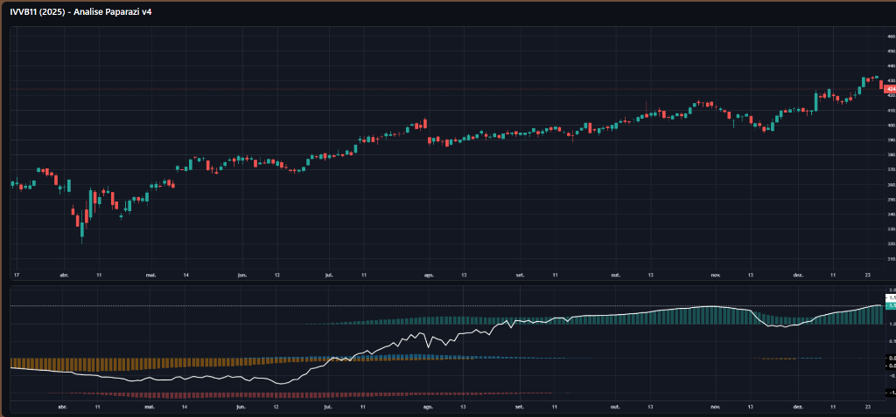

# 📈 Finanças Quantitativas e Engenharia de Portfólio

Este repositório consolida o desenvolvimento de modelos quantitativos voltados para a otimização de portfólio e gestão de risco, unindo a teoria econômica (Markowitz/CAPM) à automação em Python. O foco central é a aplicação prática de conceitos de Fronteira Eficiente, VaR e Índice de Sharpe, transformando dados brutos em suporte tático para a tomada de decisão no mercado financeiro e buscando maximizar o retorno sob uma gestão de risco rigorosa.

Abaixo estão detalhados os três motores analíticos que compõem este portfólio. Todos eles extraem e operam sobre base de dados reais de mercado.

---

### 1️⃣ Gestão de Risco e Otimização de Portfólio
**Arquivo:** `01_Gestao_Risco_e_Otimizacao_Portfolio.ipynb`

* **Objetivo + Utilidade:**
  Calcular e demonstrar estruturalmente o Risco Sistêmico do mercado, fornecendo através da Teoria Moderna de Portfólio (Markowitz) o balanço ideal (pesos %) de carteira para maximizar o retorno da estratégia em relação à exposição (Max Sharpe Ratio). Extrema utilidade para *Wealth Management* e alocação dinâmica patrimonial.
  
* **Etapas do processo:**
  1. *Aquisição e Limpeza de Dados:* Via API pública do Yahoo Finance (`yfinance`), puxamos dados históricos (Ativos isolados, Curva de taxas, IBOV versus ASX200).
  2. *Matriz de Variância-Covariância:* Criação da matriz revelando ativos não correlacionados.
  
  
  
  3. *Otimização Quadrática Numérica e Fronteira Eficiente:* Usando algoritmos matemáticos como o SLSQP do `scipy.optimize`, testamos milhares de portfólios aleatórios na escala gráfica de Risco-Retorno.
  
  

---

### 2️⃣ Backtesting e Criação de Estratégias Quantitativas
**Arquivo:** `02_Backtesting_e_Estrategias_Quantitativas.ipynb`

* **Objetivo + Utilidade:**
  Criar um robô validador (*Backtester*) para operar cruzamentos direcionais e regras matemáticas contra preços históricos sem arriscar capital. Essencial para verificar estatisticamente se a estratégia de trade possui "Margem de Vitória (Win Rate)" real antes do deploy.

* **Etapas do processo:**
  1. Comparação Direta: *Buy'n Hold versus 20 Estratégias*: Geração dinâmica de dezenas de métricas para encontrar vantagens estatísticas sobre o mercado passivo.
  
  
  
  2. Escolha de Estratégias Superiores: Filtragem algorítmica para detectar quais regras bateram o *Buy'n Hold* no período e montagem de uma Carteira Diversificada.
  
  
  
  3. Implementação e Teste de Performance: Aprofundamento do backtest da carteira unindo regras suplementares inseridas no código (RSI, Trailing Stop ou Stop-Loss).
  
  

---

### 3️⃣ Processamento de Sinais com Transformada de Fourier (Paparazi v4)
**Arquivo:** `03_Processamento_Sinais_Fourier_Paparazi.ipynb` e `paparazi_v4.py`

* **Objetivo + Utilidade:**
  Destilar dados caóticos de mercado em sinal puro através de **Digital Signal Processing (DSP)**. O modelo utiliza a lógica de Fourier para isolar ciclos harmônicos e remover o ruído branco inerente às cotações, permitindo uma visualização clara da tendência "Alpha".

* **Fundamentação Matemática (Fourier):**
  A Transformada de Fourier permite decompor uma série temporal complexa (o preço de um ativo) em suas frequências constituintes (senos e cossenos). Em termos matemáticos, convertemos o sinal do domínio do tempo para o domínio da frequência, identificando quais ciclos repetitivos possuem maior potência. Ao aplicar filtros nas altas frequências (ruído), conseguimos reconstruir o gráfico capturando apenas a essência direcional.

* **Aplicação em Gráficos de Preços:**
  No mercado financeiro, o preço é composto por *Tendência + Ciclos + Ruído*. O algoritmo **Paparazi v4** aqui implementado aplica múltiplas escalas fractais para isolar esses ciclos. Ele utiliza a tangente inversa das variações percentuais para normalizar a força de cada frequência, resultando em um indicador que não sofre de "atraso" (*lag*) como as médias móveis tradicionais.

* **Análise Visual do Dashboard:**
  
  
  
  O dashboard acima exibe a análise da IVVB11 (S&P 500 BR). 
  - **Pane Superior**: O gráfico de Candlesticks original mostrando a volatilidade bruta.
  - **Pane Inferior (O indicador)**: A linha branca representa o **Sinal Alpha** reconstruído após a filtragem DSP. As bandas coloridas (histogramas) indicam a dominância de frequência em diferentes níveis:
    - **Verde/Azul**: Dominância de ciclos de alta com momentum positivo.
    - **Vermelho/Laranja**: Pressão de ciclos de baixa ou exaustão de tendência.
  - **Observação Prática**: Note como o sinal antecipa as reversões de tendência ao identificar a perda de força nos componentes cíclicos antes mesmo da mudança brusca no preço unitário.

---

## 🚀 Como Visualizar
Se clonar este repositório para inspecionar, abra os respectivos notebooks ou execute `python paparazi_v4.py` para gerar o Dashboard HTML interativo. Caso falte bibliotecas vitais, utilize o arquivo `requirements.txt`.
