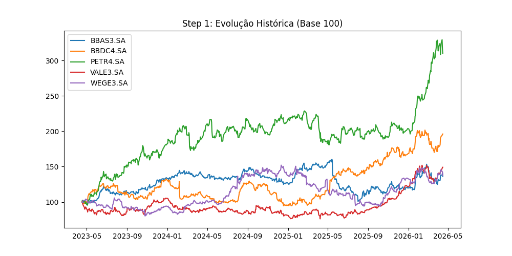
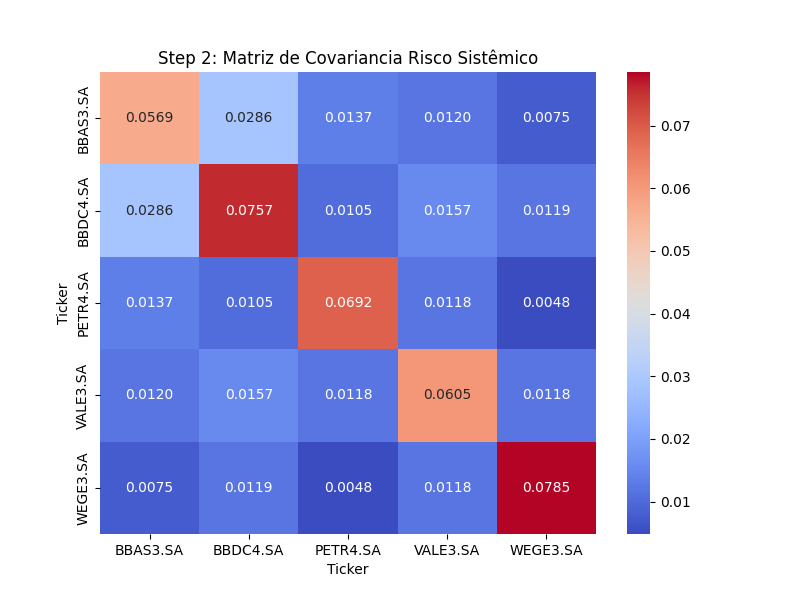
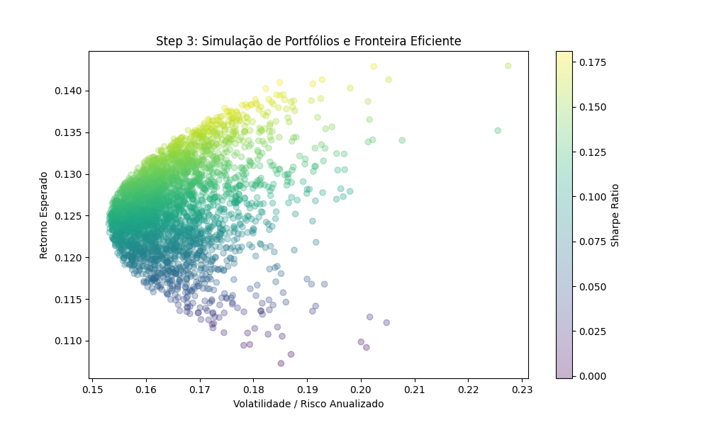
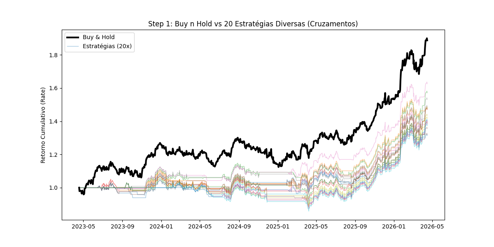
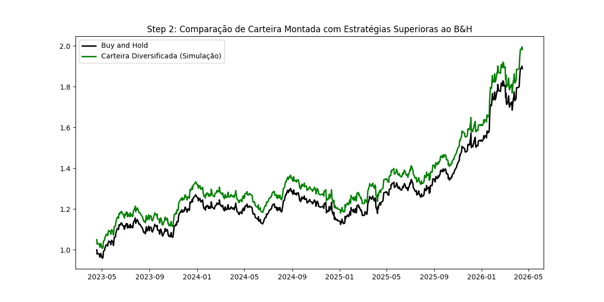
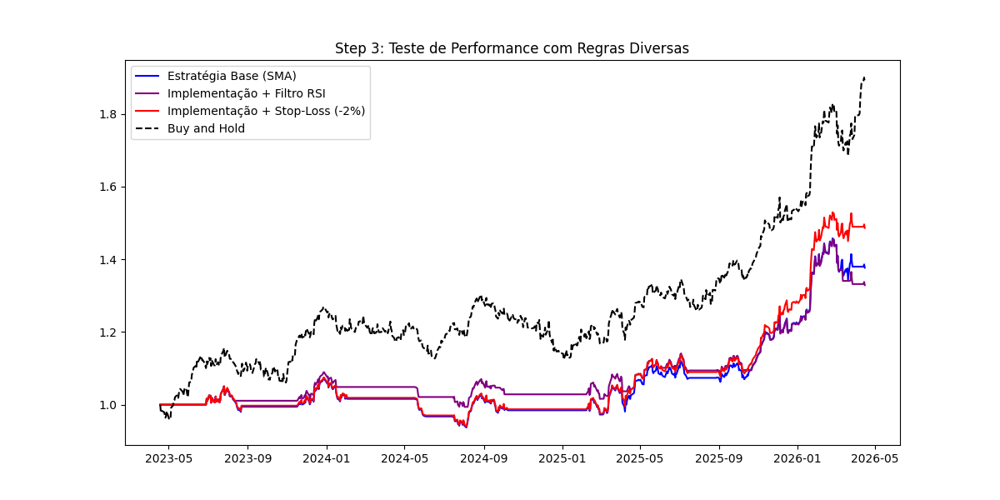

# 📈 Finanças Quantitativas e Engenharia de Portfólio

Este repositório abriga a intersecção entre **Matemática Avançada, Estatística e o Mercado Financeiro**. O ambiente foca na implementação sistemática de modelos preditivos, precificação teórica de risco e backtests algorítmicos reais usando Python.

O modelo técnico transcende a simples análise visual "gráfica", mergulhando firme na lógica orientada a dados *Intraday*, otimizadores Convexos (SciPy) e *Digital Signal Processing* (DSP).

Abaixo estão detalhados os três motores analíticos que compõem este portfólio. Todos eles extraem e operam sobre base de dados reais de mercado.

---

### 1️⃣ Gestão de Risco e Otimização de Portfólio
**Arquivo:** `01_Gestao_Risco_e_Otimizacao_Portfolio.ipynb`

* **Objetivo + Utilidade:**
  Calcular e demonstrar estruturalmente o Risco Sistêmico do mercado, fornecendo através da Teoria Moderna de Portfólio (Markowitz) o balanço ideal (pesos %) de carteira para maximizar o retorno da estratégia em relação à exposição (Max Sharpe Ratio). Extrema utilidade para *Wealth Management* e alocação dinâmica patrimonial.
  
* **Etapas do processo:**
  1. *Aquisição e Limpeza de Dados:* Via API pública do Yahoo Finance (`yfinance`), puxamos dados históricos (Ativos isolados, Curva de taxas, IBOV versus ASX200). Trata-se a falta de liquidez ou buracos de feriados com interpolações `ffill()`.
  
  
  
  2. *Matriz de Variância-Covariância:* Criação da matriz revelando ativos não correlacionados.
  
  
  
  3. *Otimização Quadrática Numérica e Fronteira Eficiente:* Usando algoritmos matemáticos como o SLSQP do `scipy.optimize`, testamos milhares de portfólios aleatórios na escala gráfica de Risco-Retorno. A curva parabólica aponta a eficiência superior.
  
  

* **Resultado prático da execução:**
  O algoritmo numérico devolve as alocações percentuais rigorosas que performarão na Fronteira Eficiente Teórica, garantindo a redução do *"Drawdown"* em crises, exibidas pontualmente no gráfico do Step 3.

---

### 2️⃣ Backtesting e Criação de Estratégias Quantitativas
**Arquivo:** `02_Backtesting_e_Estrategias_Quantitativas.ipynb`

* **Objetivo + Utilidade:**
  Criar um robô validador (*Backtester*) para operar cruzamentos direcionais e regras matemáticas contra preços históricos sem arriscar capital. Essencial para verificar estatisticamente se a estratégia de trade possui "Margem de Vitória (Win Rate)" real antes do deploy.

* **Etapas do processo:**
  1. Comparação Direta: *Buy'n Hold versus 20 Estratégias*: Geração dinâmica de dezenas de métricas e traçado de rentabilidade para encontrar vantagens estatísticas sobre o mercado passivo.
  
  
  
  2. Escolha de Estratégias Superiores: Filtragem algorítmica para detectar quais regras bateram o *Buy'n Hold* no período, e montagem de uma Carteira Diversificada unindo os sinais de múltiplas estratégias vencedoras operando simultaneamente.
  
  
  
  3. Implementação e Teste de Performance com Regras Diversas: Aprofundamento do backtest da carteira unindo regras suplementares inseridas no código (como filtro em RSI, saídas por Trailing Stop ou Stop-Loss estático) e comparando com o sinal puro para determinar a performance perfeita.
  
  

* **Resultado prático da execução:**
  A célula retorna o relatório numérico consolidado do número total de Trades realizados, Win Rate exato e capital projetado, provando algoritmicamente a existência (ou falta) de vantagem direcional pura.

---

### 3️⃣ Processamento Contínuo de Sinais (Filtro de Fourier)
**Arquivo:** `03_Processamento_Sinais_Fourier_Paparazi.ipynb`

* **Objetivo + Utilidade:**
  Destilar dados caóticos de mercado financeiro em tendências puras, através da Transformada de Rápida Fourier (FFT), anulando picos (Spikes) isolados e limpando "ruído branco" da distruibuição. Utilidade extrema para fundos High-Frequency Trading (HFT).

* **Etapas do processo:**
  1. Carregamento de arrays pesados ou base de dados em `csv` intradiário contínuo como S&P500 / IVVB11 para ter base ruidosa do modelo log-market.
  2. Submissão das séries de log-retorno a uma varredura Numérica de Frequência e tangentes do modelo Paparazi/DSP.
  3. Filtro e Reversão Inversa com matriz Tangencial, reconstruindo a linha cronológica de preço, mas dessa vez transformada apenas na onda "Alpha" perfeita de direcionamento.

* **Resultado prático da execução:**
  Os desvios padrões violentos e sombras gráficas são engolidos matematicamente, resultando numa onda previsível livre de falsos rompimentos técnicos.
  
  <!-- Cole a sua imagem final do projeto aqui embaixo -->

---

## 🚀 Como Visualizar
Se clonar este repositório para inspecionar, abra os respectivos notebooks num Kernel limpo (VS Code, Jupyter) e rode `Run All`. Caso falte bibliotecas vitais, providenciamos na raiz as restrições por meio do arquivo `requirements.txt`.
