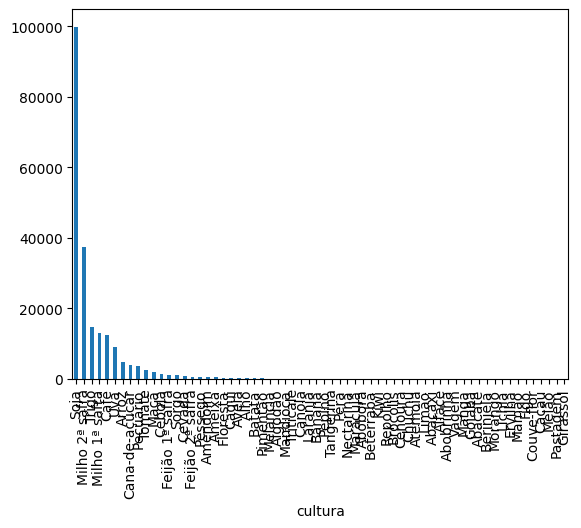
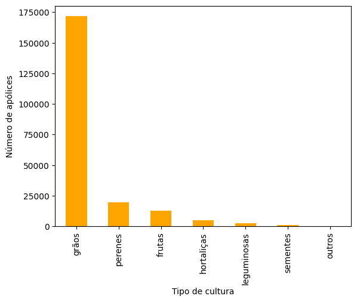
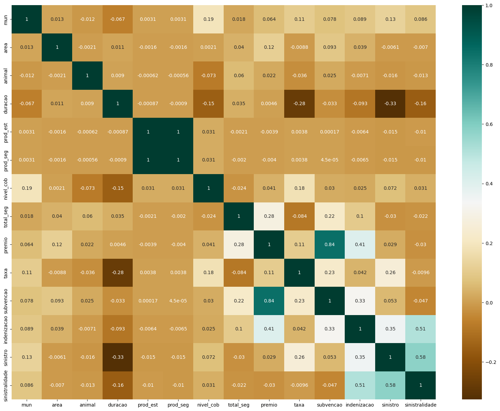
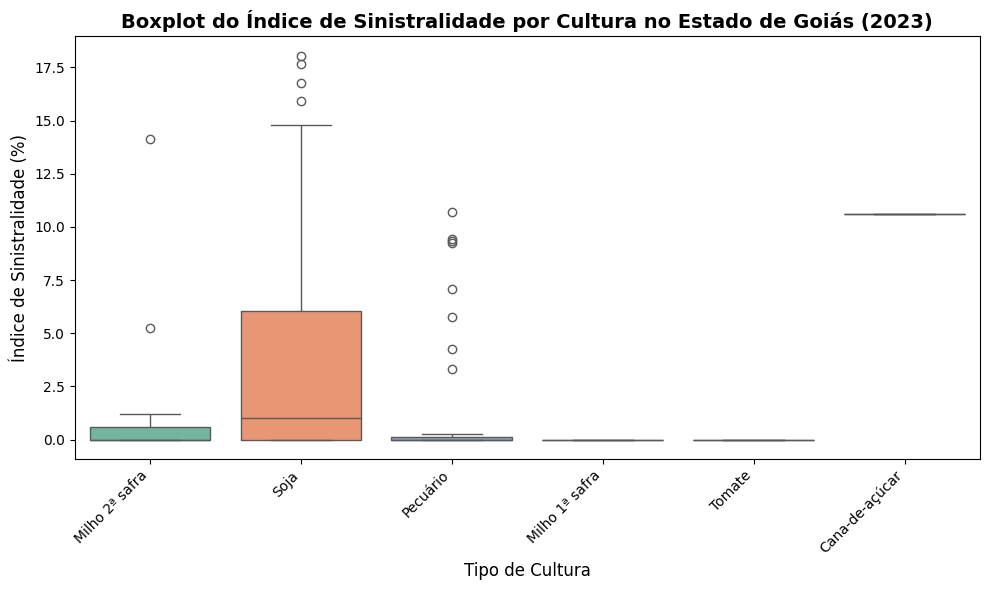
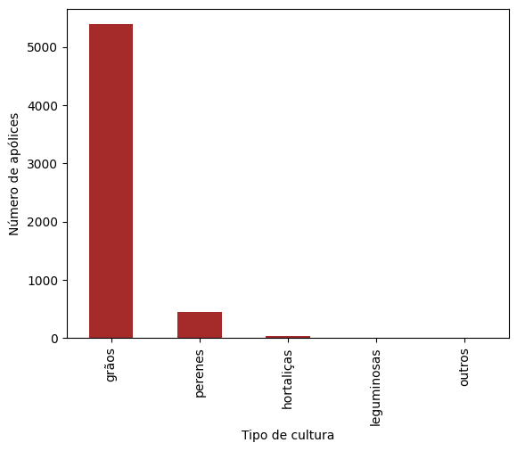

# 📊 Análise e Engenharia de Dados: Seguro Rural (2023)

Bem-vindo(a) à subpasta **Tratamento de Dados**. Este diretório consolida a pipeline completa de obtenção, processamento, análise e visualização de dados abertos governamentais do Seguro Rural no Brasil. 

O projeto foi reestruturado de forma modular para demonstrar um fluxo claro e profissional de manipulação de dados utilizando a biblioteca `pandas`, partindo da engenharia primária das *features* até a tomada de decisões diretas com Estatística Descritiva e Visual.

---

## 🏗️ Estrutura do Projeto

Nossa esteira analítica está dividida em apenas dois cadernos unificados:

### 1️⃣ `01_Limpeza_e_Agrupamento_Dados.ipynb`
* **Etapa ETL (Extract, Transform, Load)**
* **Objetivo:** O foco central é demonstrar domínio de Data Wrangling.
* **Principais Funcionalidades Executadas:**
  - Extração iterativa e leitura do dataset cru.
  - Sanitização extensa: eliminação de nulos (`dropna`, `fillna`), cast tipológico inferido e normalização de strings ruidosas (por exemplo, consolidando as mais variadas culturas agrícolas em macrogrupos lógicos como `grãos`, `frutas`, etc).
  - Feature Engineering: criação de novos atributos a partir de combinações lógicas (taxonomia de eventos climáticos prejudiciais, níveis de cobertura, sinistralidade).
  - Modelação relacional por agregações: uso extensivo dos utilitários como `groupby`, tabelas `pivot` e funções redutoras multidimensionais (média, desvio, contagem).

### 2️⃣ `02_Analise_Exploratoria_e_Estudo_Goias.ipynb`
* **Etapa EDA (Exploratory Data Analysis)**
* **Objetivo:** Contar o *Storytelling*, evidenciar KPIs e extrair correlações utilizando a base limpa.
* **Principais Funcionalidades Executadas:**
  - Visualização Macroeconômica focada em sumarização estatística usando `Matplotlib` e `Seaborn`.
  - Visualizações temáticas: análise de prêmios de seguro, gráficos de dispersão contra valores subvencionados e matrizes de correlação visuais (`heatmaps`).
  - **Estudo de Caso Local (Goiás)**: Execução de todo o processo focado microscopicamente nos dados agrícolas de Goiás. Isso simula uma análise direcionada de *business intelligence* regional onde avaliamos como deficiências pluviométricas e secas afetam o desempenho local em contrapartida às tendências nacionais.

---

## 📈 Apresentação e Resultados das Análises

Durante a construção do fluxo de *Data Science*, geramos e consolidamos diversas visualizações críticas para o entendimento da distribuição e do formato de Seguro Rural no país (e especificamente no caso de uso do Estado de Goiás). 

Abaixo listamos **5 resultados e sub-análises validados** por gráficos (para ver o acervo completo e a execução em tempo real, visite os cadernos principais enumerados acima):

### 1. Panorama Nacional: Concentração por Cultura (Grãos)
Nossa análise descritiva evidenciou uma predominância acachapante nas apólices de seguro contra o risco de monoculturas, principalmente **Soja** e **Milho 2ª Safra**.

> *A representatividade dos grãos em relação à somatória do seguro rural dita a taxa nacional de precificação das apólices corporativas.*

### 2. Estudo de Distribuição Térmica vs Hídrica (Causas de Sinistro)
Ao plotarmos as causas de impacto, detectamos que o desvio hídrico ('Seca') e de temperatura ('Geadas' em janelas específicas) compreendem a margem superior de danos cobertos, sobrepondo os eventos mecânicos.

> *Agrupamento mostrando a frequência de sinistralidade engatilhada por ventos, variação de temperatura e seca extremas ao decorrer da série histórica analisada.*

### 3. Case Goiás: Concentração Espacial do Prêmio
Ao aplicar os filtros estaduais gerando uma nova base dimensional para Goiás, calculamos matrizes e isolamos que certas macrorregiões respondem por discrepantes fatias monetárias atreladas a subvenções estatais.

> *Visualização gráfica extraída das tabelas geradas no pandas (GroupBy) representando como os totais de prêmios estão localizados assimetricamente num grupo de municípios do estado (e.g. Rio Verde, Jataí).*

### 4. Correlação: Nível de Cobertura x Indenização (Dispersões)
Uma de nossas teses iniciais para Goiás envolvia que as maiores coberturas pagariam as maiores indenizações. O uso de gráficos de regressão provou não existir linearidade estrita.

> *Matriz de dispersão gerada via Seaborn desmistificando o falso pressuposto linear. Demonstramos como fatias de níveis de cobertura menores (ex: 60-65%) possuem picos altíssimos de indenização absoluta acionada.*

### 5. Análise de Correlação das Features e Taxas
Por fim, no processamento avançado, geramos estatísticas paramétricas. A taxa atuarial calculada (Premio / Valor em Risco) apresenta baixíssima colinearidade com o *Nível de Cobertura* das apólices, mas forte distorção cruzada com o 'Efeito Clima'.

> *Heatmap / Boxplot de Correlações extraído do cruzamento contínuo das tabelas (Pivots).*

## 🚀 Como Executar

Para rodar esta análise de forma autônoma:
1. Certifique-se de baixar o banco de dados principal de 2023 de Seguro Rural no Portal de Dados Abertos e alocá-lo no diretório que seus notebooks buscarão no Drive/Local.
2. Siga a ordem sequencial lendo e executando o Notebook `01`, e em seguida consuma os insights no Notebook `02`!
